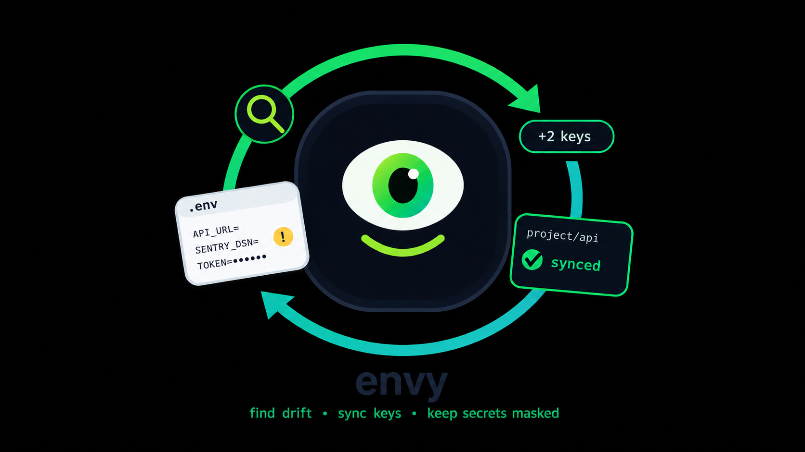
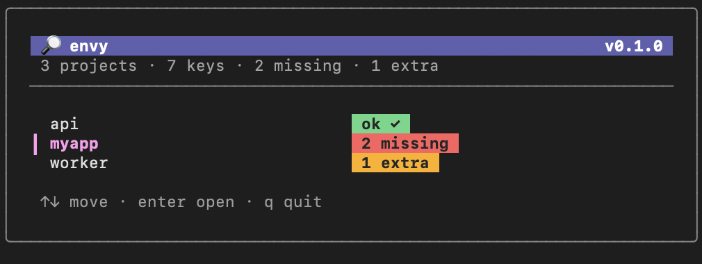
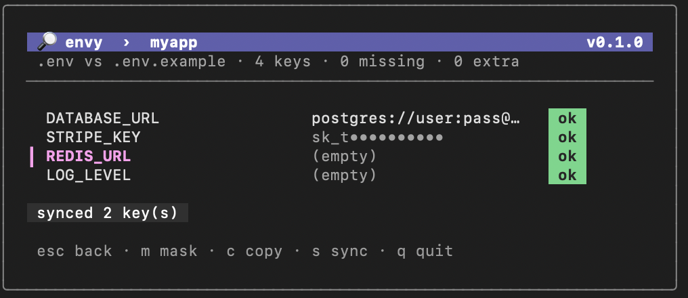

<div align="center">



# envy

### Know exactly which `.env` keys you're missing — across every project — and fix them in one keystroke.

[](https://go.dev)
[](LICENSE)
[](https://github.com/charmbracelet/bubbletea)
[](#)
[](#)


<br><br>


</div>

---

## The problem

You clone a repo, copy `.env.example`, and things work. Weeks later a teammate adds `SENTRY_DSN` to the example — and nobody tells you. Your app boots fine locally, then dies in a confusing way because one env var is silently missing.

Multiply that across five services and two `.env.local` overrides, and "which keys am I actually missing?" becomes a real, recurring waste of time.

**`envy` answers that question in one screen — and fixes it in one keypress.**

## What it does

- 🗂️ **Scans all your projects at once** and shows a dashboard of drift: `ok ✓`, `2 missing`, `1 extra`.
- 🔑 **One-key sync** — hit `s` and the missing keys are appended to your `.env`, ready to fill in.
- 🌳 **Monorepo-aware** — walks nested folders (`apps/web/.env`, `services/api/.env`) and skips the noise (`node_modules`, `vendor`, `dist`, hidden dirs).
- 🧩 **Understands layered env files** — a key set in `.env`, `.env.local`, or `.env.development` all count as present.
- 🧠 **Parses the real world** — `export`, quotes, `=` inside values, inline `# comments`, and multi-line values like PEM keys.
- 🙈 **Secrets stay masked** by default; reveal or copy just the one you need.

## Install

```bash
go install github.com/Rarex224/envy-cli/cmd/envy@latest
```

Make sure Go's bin dir is on your `PATH`:

```bash
export PATH="$PATH:$(go env GOPATH)/bin"
```

## Usage

```bash
envy            # reads envy.config.json in the current dir, or scans "."
envy ~/code     # point it at a folder of projects
```

Optionally drop an `envy.config.json` where you work:

```json
{
  "roots": ["~/code", "~/work"],
  "ignore": ["legacy", "*-archive"]
}
```

## Keybindings

| Key | Action |
|-----|--------|
| `↑` / `↓` | Move |
| `enter` | Open a project |
| `esc` | Back to the project list |
| `m` | Reveal / mask the selected value |
| `c` | Copy the selected value |
| `s` | Sync — append missing keys to `.env` |
| `q` | Quit |

## Why it's safe

Every write is **append-only** and **atomic**. Existing lines in your `.env` are never touched or reordered, and updates go through a temp file + `rename`, so an interrupted run can't corrupt your secrets.

## Built with

Go · [Bubble Tea](https://github.com/charmbracelet/bubbletea) · [Lip Gloss](https://github.com/charmbracelet/lipgloss) — packaged as a single, dependency-free binary.

## License

[MIT](LICENSE) © Rares Radu
